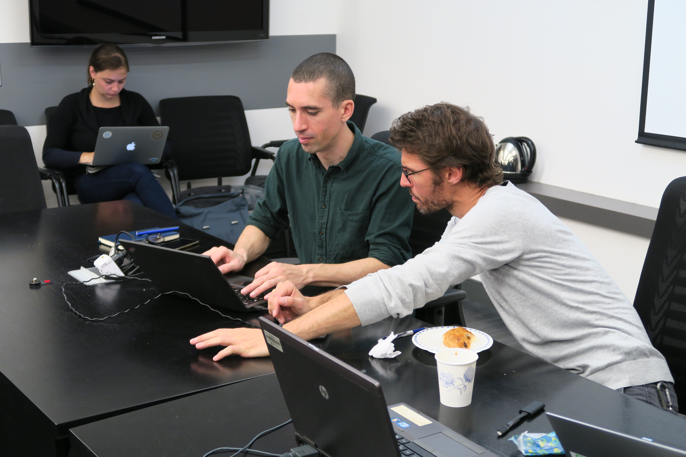
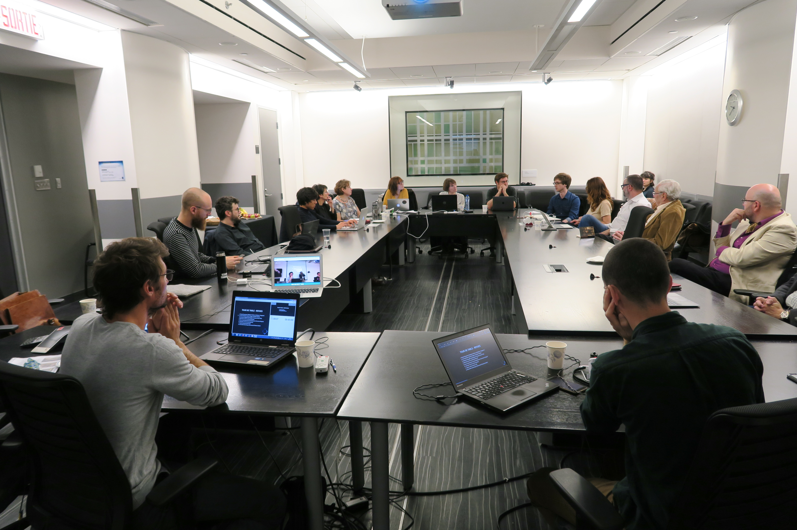
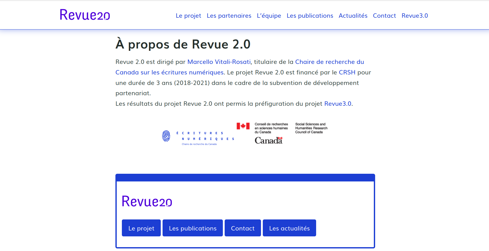
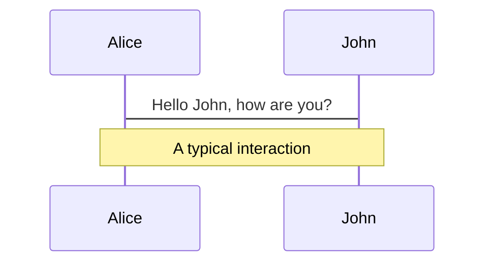
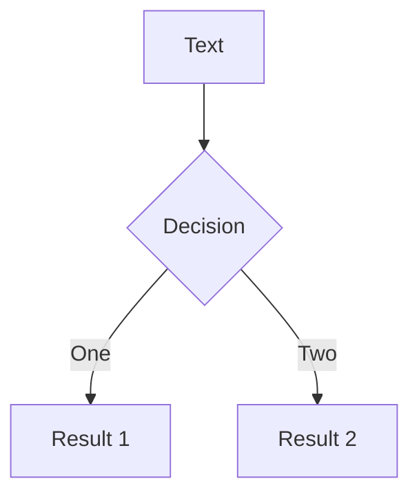
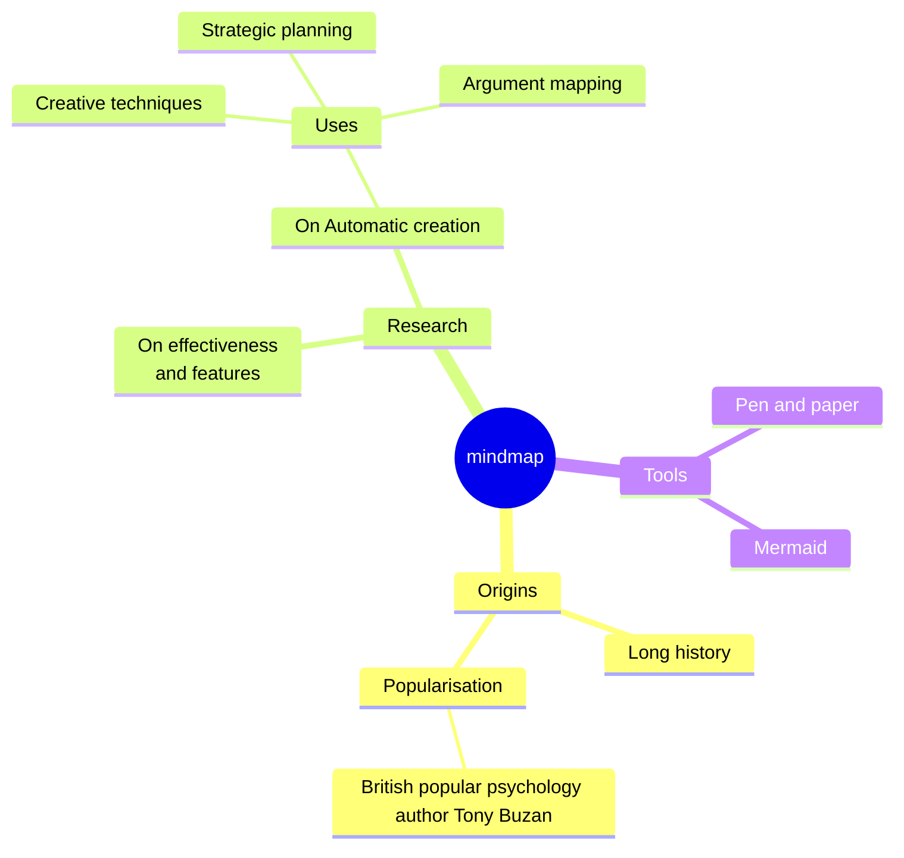
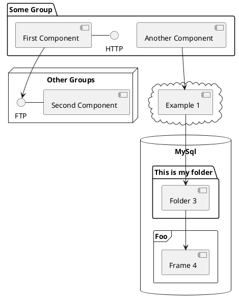

---
# You can also start simply with 'default'
theme: seriph
# random image from a curated Unsplash collection by Anthony
# like them? see https://unsplash.com/collections/94734566/slidev
background: background.svg
# some information about your slides (markdown enabled)
title: "Revue3.0 : Écrire, Transmettre,"
# apply unocss classes to the current slide
class: text-center
# https://sli.dev/features/drawing
drawings:
  persist: false
# slide transition: https://sli.dev/guide/animations.html#slide-transitions
transition: slide-left
# enable MDC Syntax: https://sli.dev/features/mdc
mdc: true
# open graph
# seoMeta:
#  ogImage: https://cover.sli.dev
themeConfig:
  primary: '#000000'
fonts:
  sans: 'Robot'
  serif: 'Robot Slab'
  mono: 'Fira Code'
---

# Revue3.0 : Écrire, Transmettre, Découvrir

Un Partenariat dirigé par Marcello Vitali-Rosati et subventionné par le Conseil de recherches en sciences humaines.

<div @click="$slidev.nav.next" class="mt-12 py-1" hover:bg="white op-10">
  La gestion d'un partenariat de recherche <carbon:arrow-right />
</div>

<div class="abs-br m-6 text-xl">
  <button @click="$slidev.nav.openInEditor()" title="Open in Editor" class="slidev-icon-btn">
    <carbon:edit />
  </button>
  <a href="https://github.com/giuliaferretti12/dall" target="_blank" class="slidev-icon-btn">
    <carbon:logo-github />
  </a>
</div>

Université de Sherbrooke | 9 avril 2025

<!--

-->

---

# Qu'est-ce qu'un projet de partenariat ?

Quelques données

- 2.5 millions au maximum
- Entre 4 et 7 ans
- Recherche au delà des institutions post-secondaires
- Coproductions connaissances
- Accessibilité de la recherche et mobilisation des connaissances
- Concours à deux étapes
- Avant du concurs : appui d'un établissement

<div style="position: relative; width: 100%; height: 100vh;">
    
</div>

---
layout: image-right
image: equipe.png
---

# Notre partenariat

Quelques données

- 25 co-chercheur.e.s
- 22 partenaires
- Équipe basée à l'Université de Montréal

<!--
You can have `style` tag in markdown to override the style for the current page.
Learn more: https://sli.dev/features/slide-scope-style
-->

<!--
Here is another comment.
-->
---
layout: center
---

# Tout a commencé avec...

Espace numérique = écriture

[https://www.ecrituresnumeriques.ca/fr](https://www.ecrituresnumeriques.ca/fr)

---
layout: cover
background: chaire.png
---


---
layout: cover
background: https://www.revue20.org/images/entete-p.jpg
---

# Revue2.0

## Développement de partenariat

[https://www.revue20.org/](https://www.revue20.org/)

---
layout: image-right
image: https://www.revue20.org/images/entete-p.jpg
---

# Revue2.0 

## Les objectifs

- Produire un modèle épistémologique pour les revues à l'époque du numérique

- Proposer un nouveau modèle éditorial pour les revues savantes en sciences humaines

<!--
**produire un modèle épistémologique pour les revues à l'époque du numérique**: retracer la mission historique des revues (voir comment celle-ci peut être remplie ou définie à l'époque du numérique) 
- e.g. changement du terme publication 
- problème de l'integration des revues dans un écosystème en évolution
- tâches pour rejoindre les **communautés savantes** sur le web

**proposer un nouveau modèle éditorial pour les revues savantes en sciences humaine**: 
- cahier de charges pour les acteurs de l'édition savante (pour assurer la pérennité et la visibilité des revues sur le web) => création d'outils et de protocoles mieux adaptés aux besoins des chercheurs et éditeurs
-->

---
layout: image-right
image: https://www.revue20.org/images/entete-p.jpg
---

# Les partenaires

- Érudit
- Open Editions
- Huma-Num
- Revue GyberGéo
- Revue Études Françaises
- Revue Intermédialités
- Revue Itinéraires
- Revue Mémoires du livre
- Revue Internationale de photolittérature

---
layout: image-right
image: https://www.revue20.org/images/entete-p.jpg
---

# Les Axes

- Axe Production
- Axe Diffusion
- Axe Agrégation


<!--Powered by [shiki-magic-move](https://shiki-magic-move.netlify.app/), Slidev supports animations across multiple code snippets.

Add multiple code blocks and wrap them with <code>````md magic-move</code> (four backticks) to enable the magic move. For example:

````md magic-move {lines: true}
```ts {*|2|*}
// step 1
const author = reactive({
  name: 'John Doe',
  books: [
    'Vue 2 - Advanced Guide',
    'Vue 3 - Basic Guide',
    'Vue 4 - The Mystery'
  ]
})
```

```ts {*|1-2|3-4|3-4,8}
// step 2
export default {
  data() {
    return {
      author: {
        name: 'John Doe',
        books: [
          'Vue 2 - Advanced Guide',
          'Vue 3 - Basic Guide',
          'Vue 4 - The Mystery'
        ]
      }
    }
  }
}
```

```ts
// step 3
export default {
  data: () => ({
    author: {
      name: 'John Doe',
      books: [
        'Vue 2 - Advanced Guide',
        'Vue 3 - Basic Guide',
        'Vue 4 - The Mystery'
      ]
    }
  })
}
```

Non-code blocks are ignored.

```vue
<!-- step 4 --
<script setup>
const author = {
  name: 'John Doe',
  books: [
    'Vue 2 - Advanced Guide',
    'Vue 3 - Basic Guide',
    'Vue 4 - The Mystery'
  ]
}
</script>
```
````
-->

---
layout: image-right
image: https://www.revue20.org/images/entete-p.jpg
---

# L'équipe de coordination

- Marcello-Vitali Rosati
- Nicolas Sauret
- Margot Mellet
- Antoine Fauchié

<!--
Marcello (et Enrico, etc.) : l'espace centrale dans la théorie de l'éditorialisation

Nicolas comme coordinateur du projet
- concept du protocol
- attention à la communauté

rileggi intro tesi per capirci meglio-->

---

# Théorie de l'éditorialisation

> L’éditorialisation est l’ensemble des dynamiques qui constituent l’espace numérique et qui permettent, à partir de cette constitution, l’émergence du sens. Ces dynamiques sont le résultat de forces et d’actions différentes qui déterminent après coup l’apparition et l’identification d’objets particuliers (personnes, communautés, algorithmes, plateformes…). 

Source : Pour une théorie de l’éditorialisation (Vitali-Rosati 2020)

<!--Tout objet, individu, collectivité n'existe que parce qu'il est modélisé, présenté et structuré dans l'espace numérique.

Toujours liées à des environnements techniques spécifiques (l'environnement numérique est prescriptif)

En ce sens, l’éditorialisation peut être pensée comme l’ensemble des conditions matérielles de médiation qui déterminent l’émergence d’un monde.-->
<div style="position: fixed; bottom: 10vh; left: 80%; transform: translateX(-50%); display: flex; gap: 3rem;">

</div>

---

# Communautés, pratiques, protocoles

- Protocoles éditoriales en tant que pratiques négociées et adoptées systématiquement par des communautés/collectifs spécifiques

- Protocoles reconfigurent les relations numériques.

Source : [https://these.nicolassauret.net/](https://these.nicolassauret.net/)

<div style="position: fixed; bottom: 15vh; left: 70%; transform: translateX(-50%); display: flex; gap: 3rem;">

</div>

---
layout: image-right
image: calendrier.png
---

# Articulation du projet

Enjeu conversationnel : revue en tant que espace/outil pour mettre en place des conversations tout au long de la chaîne éditoriale

1. **Production des contenus** : technologies numériques - production de contenus - propositions de bonnes pratiques

2. **Validation des contenus** : technologies numériques - acceptation, citation, dialogue avec l'auteur

3. **Diffusion des contenus** : technologies numériques - accessibilité et visibilité des contenus scientifiques

---
layout: iframe-right
url: https://www.revue20.org/le-projet/experimentations/
---

# Livrables 
Prototypes, expérimentations et ateliers qui se poursuivent dans le cadre de Revue3.0

- Stylo (éditeur de texte sémantique)
  - Évaluation ouverte avec Hypothesis
  - Indexation par mots clés contrôlés
  - Chaînes de publications
- Analyse de gros corpus de revues
- Atelier de réflexion et travail autour du langage 

[https://www.revue20.org/le-projet/experimentations/](https://www.revue20.org/le-projet/experimentations/)

---

# Dispositifs de gestion

- 📍 Coordination montréalaise
- 🌐 Site internet comme vitrine-dispositif assurant la cohérence de la recherche
- 💬 Mattermost pour une communication plus fluide

<div style="position: fixed; bottom: 18vh; left: 38%; transform: translateX(-50%); display: flex; gap: 3rem;">
  
  
  
</div>

<!--
Gouvernance souple : la coordination assure à la fois le suivi direct et la gestion opérationnelle du projet.

Relations directes : la direction sollicite directement les partenaires et co-chercheur.e.s, ce qui favorise la fluidité des échanges.

Limites : cette souplesse peut toutefois poser des problèmes en cas de conflits, notamment en l’absence d’un système clair de légitimation ou de protection des décisions. La coordination générale doit ainsi justifier chaque décision prise, sans cadre formel qui en garantisse la validité.

Enjeux de **communication** : cruciaux pour le bon fonctionnement du projet (cf. les difficultés rencontrées avec CyberGéo).
-->

---
layout: iframe-right
url: https://revue30.org/
class: custom-iframe-content
---

# Revue.0

## Du prototype à la mise en œuvre à grande échelle

<!--ambition-->
- Multiplications des projets
- Pluralité des savoirs <!--questionnement des critères de scientificité d'une revue, à niveau de formats, contenus (cfr. recherche-création)-->
- Pluralité de formes de production, diffusion et légitimation de la connaissance
- Pour que les revues savantes puissent rester les protagonistes des savoirs de demain

---
layout: image-right
url: background.svg
---

## Donc...

- La temporalité du projet s’étend au-delà de sa durée officielle
- Ramification et multiplication des projets
- Multiplication du nombre des partenaires et de co-chercheur.euse.s
- Une évolution constante de la composition de l'équipes, à tous les niveaux du projet

---

# Nouveaux Axes/chantiers de recherche

---

<!--@add : historique des demandes, changement du projet dans ce temps d'« attente »-->

---
layout: iframe-right
url: https://baserow.ecrituresnumeriques.ca/form/jsFu69p4JYhZtzcJisO4nAVja2OgLwRkdqxM32a7_v0
---

# Des prototypes aux projets formellement définis

<small>Face à cette multiplication, les prototypes ont laissé place à des projets, _définis formellement_ selon les critères suivants :</small>

- <small>Au moins un partenaire externe et deux co-chercheurs</small>
- <small>Au moins un axe de recherche spécifique</small>
- <small>Chaque projet doit produire au minimum :</small>
  - <small>Un livrable technique</small>
  - <small>Deux livrables d'ordre théorique</small>
- <small> Un **formulaire** pour proposer des nouveaux projets</small> →


Mais, **Dans la pratique...**

---

| **Axe 1 Écrire** | **Axe 2 Transmettre** | **Axe 3 Découvrir** | **Transversaux** |
|--------------|-------------------|-----------------|----------|
| Suggestion automatique de références bibliographiques | Modélisation des revisions | Protocoles annotations Sens Public |  Refonte métadonnées Stylo |
| Référentiel des flux éditoriaux | Expérimentations avec IEML dans Stylo/ Isidore | Modélisation du site | Export Stylo (sites revues) |
| Pink my Stylo | Création automatique d'un contexte sémantique dans les articles Stylo | Révision bibliographique avec IA | Export Imaginations |
| Expérimentations avec Cosma | | | Modélisation du site Revue3.0 |

<!--
À partir des projets pilotes menés dans le cadre de Revue3.0

- Édition avec Stylo
- Indexation de mots clés
- évaluation ouverte (cfr. Thèse de Nicolas)
-->

---

# Components

<div grid="~ cols-2 gap-4">
<div>

You can use Vue components directly inside your slides.

We have provided a few built-in components like `<Tweet/>` and `<Youtube/>` that you can use directly. And adding your custom components is also super easy.

```html
<Counter :count="10" />
```

<!-- ./components/Counter.vue -->
<Counter :count="10" m="t-4" />

Check out [the guides](https://sli.dev/builtin/components.html) for more.

</div>
<div>

```html
<Tweet id="1390115482657726468" />
```

<Tweet id="1390115482657726468" scale="0.65" />

</div>
</div>

<!--
Presenter note with **bold**, *italic*, and ~~striked~~ text.

Also, HTML elements are valid:
<div class="flex w-full">
  <span style="flex-grow: 1;">Left content</span>
  <span>Right content</span>
</div>
-->

---
class: px-20
---

# Themes

Slidev comes with powerful theming support. Themes can provide styles, layouts, components, or even configurations for tools. Switching between themes by just **one edit** in your frontmatter:

<div grid="~ cols-2 gap-2" m="t-2">

```yaml
---
theme: default
---
```

```yaml
---
theme: seriph
---
```


</div>

Read more about [How to use a theme](https://sli.dev/guide/theme-addon#use-theme) and
check out the [Awesome Themes Gallery](https://sli.dev/resources/theme-gallery).

---

# Clicks Animations

You can add `v-click` to elements to add a click animation.

<div v-click>

This shows up when you click the slide:

```html
<div v-click>This shows up when you click the slide.</div>
```

</div>

<br>

<v-click>

The <span v-mark.red="3"><code>v-mark</code> directive</span>
also allows you to add
<span v-mark.circle.orange="4">inline marks</span>
, powered by [Rough Notation](https://roughnotation.com/):

```html
<span v-mark.underline.orange>inline markers</span>
```

</v-click>

<div mt-20 v-click>

[Learn more](https://sli.dev/guide/animations#click-animation)

</div>

---

# Motions

Motion animations are powered by [@vueuse/motion](https://motion.vueuse.org/), triggered by `v-motion` directive.

```html
<div
  v-motion
  :initial="{ x: -80 }"
  :enter="{ x: 0 }"
  :click-3="{ x: 80 }"
  :leave="{ x: 1000 }"
>
  Slidev
</div>
```

<div class="w-60 relative">
  <div class="relative w-40 h-40">
    
    
    
  </div>

  <div
    class="text-5xl absolute top-14 left-40 text-[#2B90B6] -z-1"
    v-motion
    :initial="{ x: -80, opacity: 0}"
    :enter="{ x: 0, opacity: 1, transition: { delay: 2000, duration: 1000 } }">
    Slidev
  </div>
</div>

<!-- vue script setup scripts can be directly used in markdown, and will only affects current page -->
<script setup lang="ts">
const final = {
  x: 0,
  y: 0,
  rotate: 0,
  scale: 1,
  transition: {
    type: 'spring',
    damping: 10,
    stiffness: 20,
    mass: 2
  }
}
</script>

<div
  v-motion
  :initial="{ x:35, y: 30, opacity: 0}"
  :enter="{ y: 0, opacity: 1, transition: { delay: 3500 } }">

[Learn more](https://sli.dev/guide/animations.html#motion)

</div>

---

# LaTeX

LaTeX is supported out-of-box. Powered by [KaTeX](https://katex.org/).

<div h-3 />

Inline $\sqrt{3x-1}+(1+x)^2$

Block
$$ {1|3|all}
\begin{aligned}
\nabla \cdot \vec{E} &= \frac{\rho}{\varepsilon_0} \\
\nabla \cdot \vec{B} &= 0 \\
\nabla \times \vec{E} &= -\frac{\partial\vec{B}}{\partial t} \\
\nabla \times \vec{B} &= \mu_0\vec{J} + \mu_0\varepsilon_0\frac{\partial\vec{E}}{\partial t}
\end{aligned}
$$

[Learn more](https://sli.dev/features/latex)

---

# Diagrams

You can create diagrams / graphs from textual descriptions, directly in your Markdown.

<div class="grid grid-cols-4 gap-5 pt-4 -mb-6">









</div>

Learn more: [Mermaid Diagrams](https://sli.dev/features/mermaid) and [PlantUML Diagrams](https://sli.dev/features/plantuml)

---
foo: bar
dragPos:
  square: 691,32,167,_,-16
---

# Draggable Elements

Double-click on the draggable elements to edit their positions.

<br>

###### Directive Usage

```md

```

<br>

###### Component Usage

```md
<v-drag text-3xl>
  <div class="i-carbon:arrow-up" />
  Use the `v-drag` component to have a draggable container!
</v-drag>
```

<v-drag pos="663,206,261,_,-15">
  <div text-center text-3xl border border-main rounded>
    Double-click me!
  </div>
</v-drag>


###### Draggable Arrow

```md
<v-drag-arrow two-way />
```

<v-drag-arrow pos="67,452,253,46" two-way op70 />

---
src: ./pages/imported-slides.md
hide: false
---

---

# Monaco Editor

Slidev provides built-in Monaco Editor support.

Add `{monaco}` to the code block to turn it into an editor:

```ts {monaco}
import { ref } from 'vue'
import { emptyArray } from './external'

const arr = ref(emptyArray(10))
```

Use `{monaco-run}` to create an editor that can execute the code directly in the slide:

```ts {monaco-run}
import { version } from 'vue'
import { emptyArray, sayHello } from './external'

sayHello()
console.log(`vue ${version}`)
console.log(emptyArray<number>(10).reduce(fib => [...fib, fib.at(-1)! + fib.at(-2)!], [1, 1]))
```

---
layout: center
class: text-center
---

# Learn More

[Documentation](https://sli.dev) · [GitHub](https://github.com/slidevjs/slidev) · [Showcases](https://sli.dev/resources/showcases)

<PoweredBySlidev mt-10 />
